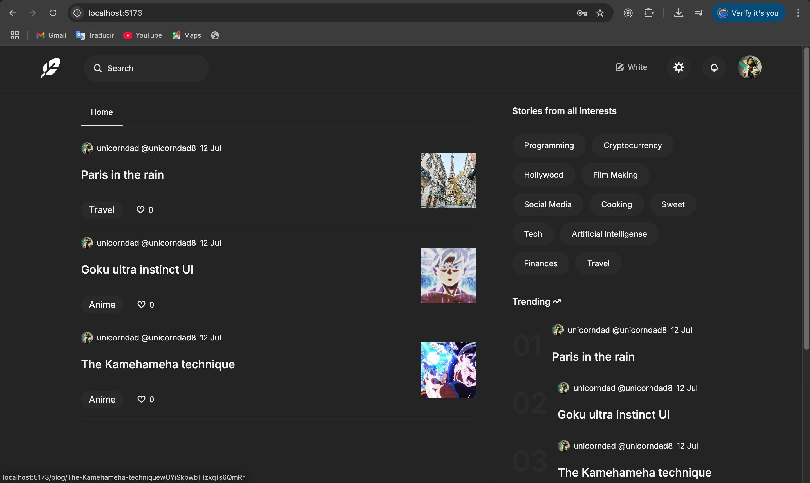

#  🧐 MERN Blog

> This is a complete blog consumming API made with React and Tailwind css.



## 🔧 Built With

- HTML
- Tailwind CSS
- React
- Flaticons
- (consumming Node.Js API)

## 🔴 Live Demo

[Live Demo](https://friendly-jelly-35092b.netlify.app/)


## 🛠 Getting Started

To get a local copy up and running follow these simple example steps.

- Go to the main page of te repo.
- Press the ```Code``` button and get the repo link.
- Clone it using git.

## ✒️ Authors

👤 **Cecilia Benitez**

- [@Ceci007](https://github.com/Ceci007)


## 🤝 Contributing

Contributions, issues and feature requests are welcome!

Feel free to check the [issues page](issues/).

## 📝 License

This project is [MIT](lic.url) licensed.
